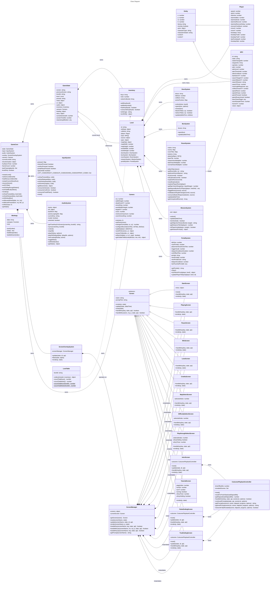

# Class Diagram

```mermaid
---
title: Class Diagram
---
classDiagram
    direction LR

    class Entity {
        -x: number
        -y: number
        -w: number
        -h: number
        -facing: string
        -moving: boolean
        -anim: object
        -characterType: string
        -characterVariant: string
        +centerX
        +centerY
    }

    class Player {
        -speed: number
        -sprint: number
        -stamina: number
        -staminaMax: number
        -staminaDrain: number
        -staminaRecover: number
        -staminaRecoverDelay: number
        -recoverCooldown: number
        -moveX: number
        -moveY: number
        -footsteps: Array
        -footstepTrailX: number
        -footstepTrailY: number
        -lastFootstepAt: number
        -footstepSide: number
    }

    class NPC {
        -id: string
        -state: string
        -stateChangedAt: number
        -waypoints: Array
        -wpIndex: number
        -alert: number
        -alertLevel: number
        -alertThreshold: number
        -alertCooldown: number
        -lastSeenX/Y: number
        -searchTargetX/Y: number
        -searchBaseX/Y: number
        -searchReason: string
        -searchTimer: number
        -roomLightResponse: any
        -collisionInsetX/Y: number
        -speedPatrol: number
        -speedChase: number
        -patrolForward: boolean
        -patrolRouteJoined: boolean
        -doorCloseTarget: any
        -stuckSampleTimer: number
        -homeX/Y: number
        -vision: object
    }

    Entity <|-- Player
    Entity <|-- NPC

    class GameCore {
        -state: GameState
        -input: InputSystem
        -audio: AudioSystem
        -overlay: ScreenOverlaySystem
        -camera: Camera
        -currentLevelId: string
        -introAnimation: object
        -hudSyncTimer: number
        -frameCount: number
        -lastChasingNpcIds: Set
        -levelDirty: boolean
        +restartLevel()
        +switchLevel(levelId)
        +loadStoryLevel(levelId)
        +restartCurrentStoryRun()
        +resumeGame()
        +exitToTitle()
        +exitToPlaythroughSelect()
        +exitToDifficultySelect()
        +render(p)
        +onKeyPressed(key, keyCode)
        +onKeyReleased(key, keyCode)
        +onWindowBlur()
        +onMouseWheel(delta, mx, my)
        +onMousePressed(mx, my, btn, p)
        +onResize(w, h)
        +getState()
    }

    class GameState {
        -screen: string
        -previousScreen: string
        -levelId: string
        -level: Level
        -prompt: string
        -meta: object
        -ui: object
        -audio: object
        -inventory: Inventory
        -camera: Camera
        -loading: object
        -story: object
        -screenEnteredAt: number
        -screenTimeMs: number
        -nearestLightButton: any
    }

    class InputSystem {
        -pressed: Map
        -interactPressed: boolean
        -confirmPressed: boolean
        -portalPlacePressed: boolean
        -spaceHeld: boolean
        -LEFT_CODES/RIGHT_CODES/UP_CODES/DOWN_CODES/SPRINT_CODES: Set
        +onKeyPressed(key, code)
        +onKeyReleased(key, code)
        +onDomKeyDown(key, code)
        +onDomKeyUp(key, code)
        +getMovement() object
        +consumeInteract() boolean
        +consumeConfirm() boolean
        +consumePortalPlace() boolean
        +reset()
    }

    GameCore *-- GameState : owns
    GameCore *-- InputSystem : owns
    GameCore *-- AudioSystem : owns
    GameCore *-- ScreenOverlaySystem : owns
    GameCore *-- Camera : owns
    GameState *-- Inventory : owns
    GameState o-- Camera : references
    GameState o-- Level : current level

    class Level {
        -id: string
        -settings: object
        -collision: Array
        -player: Player
        -npcs: NPC[]
        -source: object
        -spec: object
        -mapData: object
        -mapWidth: number
        -mapHeight: number
        -worldWidth: number
        -worldHeight: number
        -doorSystem: DoorSystem
        -boxSystem: BoxSystem
        -roomSystem: RoomSystem
        -missionSystem: MissionSystem
        -portalSystem: PortalSystem
    }

    Level *-- Player : owns
    Level *-- NPC : owns many
    Level *-- DoorSystem : owns
    Level *-- BoxSystem : owns
    Level *-- RoomSystem : owns
    Level *-- MissionSystem : owns
    Level *-- PortalSystem : owns

    class Camera {
        -x/y: number
        -width/height: number
        -deadZoneX/Y: number
        -smoothing: number
        -worldWidth/Height: number
        -targetX/Y: number
        -zoom: number
        -minZoom/maxZoom: number
        -zoomSmoothing: number
        +resize(w, h)
        +setZoom(zoom)
        +changeZoom(delta, cx, cy) number
        +configureBounds(mwTiles, mhTiles, tileSize)
        +update(player, deltaTime)
        +worldToScreen(x, y) object
        +screenToWorld(x, y) object
        +isRectVisible(x, y, w, h, pad) boolean
        +getVisibleTileBounds(tileSize, mw, mh) object
    }

    class DoorSystem {
        -doors: Array
        -tileSize: number
        -collision: Array
        -activePushes: Map
        +unlock(door, keyId)
        +open(door, options)
        +close(door)
        +blocksTile(tx, ty) boolean
        +isDoorTile(tx, ty) boolean
        +update(deltaTime, entities)
    }

    class BoxSystem {
        -boxes: Array
        +open(box)
        +update(deltaTime)
    }

    class RoomSystem {
        -matrix: Array
        -rooms: Map
        -roomTiles: Map
        -buttons: Array
        -attachedNpcs: NPC[]
        -baseTile: number
        -chaseVisionMultiplier: number
        -darkVisionMultiplier: number
        -normalVisionMultiplier: number
        +attachNpcs(npcs)
        +getRoomId(tx, ty) string
        +getActorRoomId(actor) string
        +isLit(roomId) boolean
        +isExplored(roomId) boolean
        +exploreRoom(roomId)
        +resetExploration()
        +explorePlayerRoom(player)
        +getNpcVisionRange(npc, baseRange) number
        +getNearestButtonForPlayer(player, maxDist) any
        +toggleRoom(roomId, source)
        +notifyNpcsOfLightChange(roomId, source)
        +consumeButtonResponse(button, source)
        +update(deltaTime)
        +getUnexploredRooms() Array
    }

    class MissionSystem {
        -exit: object
        +unlock()
        +update(deltaTime)
        +isUnlocked() boolean
        +getObjectiveText(collected, target) string
        +getDistanceToExit(player) number
        +isPlayerInside(player, margin) boolean
        +getInteractPrompt() object
    }

    class PortalSystem {
        -tileSize: number
        -maxPortals: number
        -placementScanExtraTiles: number
        -triggerScale: number
        -teleportCooldownDuration: number
        -exitOffsetTiles: number
        -portals: Array
        -nextPortalId: number
        -nextPortalColor: string
        -teleportCooldown: number
        -lastTouchedPortalId: any
        +getPortals() Array
        +clear()
        +tryPlaceInFront(player, level) object
        +updatePlayerTeleport(player, level, dt)
    }

    class AudioSystem {
        -tracks: object
        -sfx: object
        -lastSfxAt: Map
        -activeLoopingSfx: Map
        -currentKey: string
        -muted: boolean
        -unlocked: boolean
        +getTrackKeyForScreen(screenKey, levelId) string
        +sync(screenKey, levelId)
        +unlock()
        +stopAll()
        +playSfx(key, options)
        +playSfxDelayed(key, delayMs, options)
        +setLoopingSfx(key, active)
        +toggleMute()
        +setMuted(value)
        +getState() object
    }

    RoomSystem o-- NPC : tracks

    class Inventory {
        -keys: Array
        -note: number
        -notesCollected: Array
        +addKey(keyId)
        +addNote(noteId)
        +hasKey(keyId) boolean
        +consumeKey(keyId) boolean
        +toString() string
        +toJSON() object
    }

    class LootTable {
        -levelId: string
        +collect(chestId, inventory) object
        +countTotalKeys() number
        +countTotalNotes() number
        +countTotalKeys(levelId)$ number
        +countTotalNotes(levelId)$ number
    }

    LootTable ..> Inventory : operates on

    class MinHeap {
        -data: Array
        -compare: Function
        +size
        +push(value)
        +pop() any
        -bubbleUp(index)
        -bubbleDown(index)
    }

    class Screen {
        <<abstract>>
        -name: string
        -promptText: string
        +render(p, state)*
        +update(state, deltaTime)
        +reset(state)
        +handleKey(key, state, api) boolean
        +handleMouse(mx, my, p, state, api) boolean
    }

    class StartScreen {
        -menu: object
        +reset()
        +handleKey(key, state, api)
        +render(p, state)
    }

    class PlayingScreen {
        +handleKey(key, state, api)
        +render(p, state)
    }

    class PauseScreen {
        +handleKey(key, state, api)
        +render(p, state)
    }

    class WinScreen {
        +handleKey(key, state, api)
        +render(p, state)
    }

    class LoseScreen {
        +handleKey(key, state, api)
        +render(p, state)
    }

    class CreditsScreen {
        +handleKey(key, state, api)
        +render(p, state)
    }

    class MapSelectScreen {
        -selectedIndex: number
        +handleKey(key, state, api)
        +render(p, state)
    }

    class DifficultySelectScreen {
        -selectedIndex: number
        +handleKey(key, state, api)
        +render(p, state)
    }

    class PlaythroughSelectScreen {
        -selectedIndex: number
        -eKeyHolding: boolean
        -eKeyTimer: number
        +handleKey(key, state, api)
        +render(p, state)
    }

    class IntroScreen {
        -cutscene: CutscenePlaybackController
        +reset()
        +update(state, dt, api)
        +handleKey(key, state, api)
        +render(p, state)
    }

    class TutorialScreen {
        -pageIndex: number
        -turnDir: number
        -turnT: number
        -turning: boolean
        -eKeyTimer: number
        -eKeyHolding: boolean
        +render(p, state)
    }

    class FalseEndingScreen {
        -cutscene: CutscenePlaybackController
        +reset()
        +update(state, dt, api)
        +handleKey(key, state, api)
        +render(p, state)
    }

    class TrueEndingScreen {
        -cutscene: CutscenePlaybackController
        +reset()
        +update(state, dt, api)
        +handleKey(key, state, api)
        +render(p, state)
    }

    Screen <|-- StartScreen
    Screen <|-- PlayingScreen
    Screen <|-- PauseScreen
    Screen <|-- WinScreen
    Screen <|-- LoseScreen
    Screen <|-- CreditsScreen
    Screen <|-- MapSelectScreen
    Screen <|-- DifficultySelectScreen
    Screen <|-- PlaythroughSelectScreen
    Screen <|-- IntroScreen
    Screen <|-- TutorialScreen
    Screen <|-- FalseEndingScreen
    Screen <|-- TrueEndingScreen

    class ScreenManager {
        -screens: object
        -currentScreen: Screen
        +getScreen(name) Screen
        +reset(screenName, state)
        +update(screenName, state, dt, api)
        +render(screenName, p, state)
        +handleKey(screenName, key, state, api) boolean
        +handleMouse(screenName, mx, my, p, state, api) boolean
        +handleKeyUp(screenName, key, state, api) boolean
        +getPrompt(screenName) string
    }

    class ScreenOverlaySystem {
        -screenManager: ScreenManager
        +update(state, dt, api)
        +flash(state, alpha)
        +render(p, state)
    }

    class CutscenePlaybackController {
        -timeOffsetMs: number
        -revealedScenes: Set
        +reset()
        +resetForFreshStart(rawElapsedMs)
        +getElapsed(rawElapsedMs) number
        +handleEnter(key, state, api, sceneList, options) boolean
        +continueIfComplete(state, api, sceneList, options)
        +getPrompt(sceneList, scene, elapsed, progress, options) string
        +getHudPrompt(sceneList, scene, elapsed, progress, options) string
        +isSceneFullyRevealed(scene, elapsed, progress, options) boolean
    }

    ScreenOverlaySystem *-- ScreenManager : owns
    ScreenManager *-- StartScreen : instantiates
    ScreenManager *-- PlayingScreen : instantiates
    ScreenManager *-- PauseScreen : instantiates
    ScreenManager *-- WinScreen : instantiates
    ScreenManager *-- LoseScreen : instantiates
    ScreenManager *-- CreditsScreen : instantiates
    ScreenManager *-- MapSelectScreen : instantiates
    ScreenManager *-- DifficultySelectScreen : instantiates
    ScreenManager *-- PlaythroughSelectScreen : instantiates
    ScreenManager *-- IntroScreen : instantiates
    ScreenManager *-- TutorialScreen : instantiates
    ScreenManager *-- FalseEndingScreen : instantiates
    ScreenManager *-- TrueEndingScreen : instantiates

    IntroScreen *-- CutscenePlaybackController : owns
    FalseEndingScreen *-- CutscenePlaybackController : owns
    TrueEndingScreen *-- CutscenePlaybackController : owns
```
