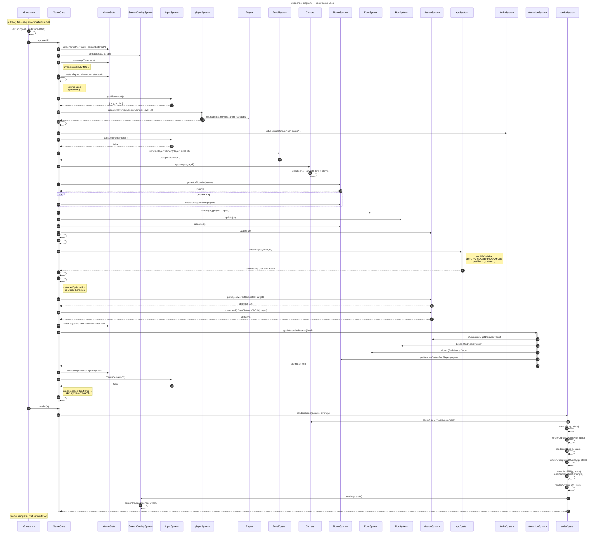

# Game Loop Sequence Diagram

```mermaid
---
title: Sequence Diagram — Core Game Loop
---
sequenceDiagram
    autonumber
    participant p5 as p5 instance
    participant GC as GameCore
    participant GS as GameState
    participant Overlay as ScreenOverlaySystem
    participant Input as InputSystem
    participant PlayerSys as playerSystem
    participant Player
    participant Portal as PortalSystem
    participant Cam as Camera
    participant Room as RoomSystem
    participant Door as DoorSystem
    participant "Box" as BoxSystem
    participant Mission as MissionSystem
    participant NPCSys as npcSystem
    participant Audio as AudioSystem
    participant Interact as interactionSystem
    participant Render as renderSystem

    Note over p5: p.draw() fires (requestAnimationFrame)

    p5->>p5: dt = min(0.05, deltaTime/1000)
    p5->>GC: update(dt)
    activate GC

    GC->>GS: screenTimeMs = now - screenEnteredAt
    GC->>Overlay: update(state, dt, api)
    GC->>GS: messageTimer -= dt
    Note right of GC: screen === PLAYING ✓
    GC->>GS: meta.elapsedMs = now - startedAt

    GC->>GC: #updateIntroAnimation(dt)
    Note right of GC: returns false<br/>(past intro)

    GC->>Input: getMovement()
    Input-->>GC: { x, y, sprint }

    GC->>PlayerSys: updatePlayer(player, movement, level, dt)
    activate PlayerSys
    PlayerSys->>Player: x/y, stamina, moving, anim, footsteps
    PlayerSys-->>GC: 
    deactivate PlayerSys

    GC->>GC: #syncRunningSfx(movement, player)
    GC->>Audio: setLoopingSfx('running', active?)

    GC->>Input: consumePortalPlace()
    Input-->>GC: false
    GC->>Portal: updatePlayerTeleport(player, level, dt)
    Portal-->>GC: { teleported: false }

    GC->>Cam: update(player, dt)
    Cam->>Cam: dead-zone + smooth lerp + clamp

    GC->>Room: getActorRoomId(player)
    Room-->>GC: roomId
    alt roomId > 1
        GC->>Room: explorePlayerRoom(player)
    end

    GC->>Door: update(dt, [player, ...npcs])
    GC->>"Box": update(dt)
    GC->>Room: update(dt)
    GC->>Mission: update(dt)

    GC->>GC: #snapshotDoorStates(level)
    GC->>GC: #snapshotRoomLightStates(level)

    GC->>NPCSys: updateNpcs(level, dt)
    activate NPCSys
    Note right of NPCSys: per-NPC: vision,<br/>alert, PATROL/SEARCH/CHASE,<br/>pathfinding, steering
    NPCSys-->>GC: detectedBy (null this frame)
    deactivate NPCSys

    GC->>GC: #playAlertOnNewNpcChase(level)
    GC->>GC: #playEnemyWorldInteractionSfx(before, before)
    Note right of GC: detectedBy is null →<br/>no LOSE transition

    GC->>Mission: getObjectiveText(collected, target)
    Mission-->>GC: objective text
    GC->>Mission: isUnlocked() / getDistanceToExit(player)
    Mission-->>GC: distance
    GC->>GS: meta.objective / meta.exitDistanceText

    GC->>Interact: getInteractionPrompt(level)
    activate Interact
    Interact->>Mission: isUnlocked / getDistanceToExit
    Interact->>"Box": boxes (findNearbyEntity)
    Interact->>Door: doors (findNearbyDoor)
    Interact->>Room: getNearestButtonForPlayer(player)
    Interact-->>GC: prompt or null
    deactivate Interact
    GC->>GS: nearestLightButton / prompt text

    GC->>Input: consumeInteract()
    Input-->>GC: false
    Note right of GC: E not pressed this frame →<br/>skip tryInteract branch

    GC->>GC: #syncHud(dt)
    deactivate GC

    p5->>GC: render(p)
    activate GC
    GC->>Render: renderScene(p, state, overlay)
    activate Render
    Render->>Cam: zoom / x / y (via state.camera)
    Render->>Render: renderMap(p, state)
    Render->>Render: renderLightingOverlay(p, state)
    Render->>Render: renderEntities(p, state)
    Render->>Render: renderUnexploredOverlay(p, state)
    Render->>Render: renderWorldUi(p, state)<br/>(door/button/chest prompts)
    Render->>Render: renderScreenUi(p, state)
    Render->>Overlay: render(p, state)
    Overlay->>Overlay: screenManager render / flash
    Render-->>GC: 
    deactivate Render
    deactivate GC

    Note over p5: Frame complete, wait for next RAF
```
